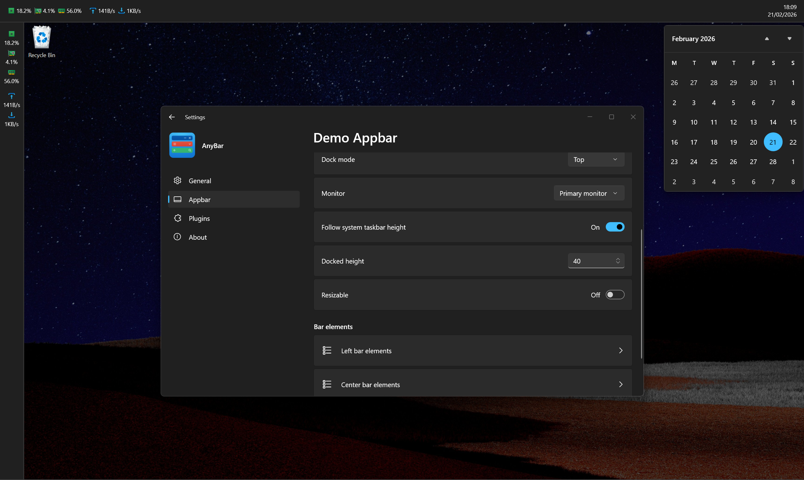

# AnyBar

📟 Bring any bars like status, tool or command bar to your Windows!

AnyBar is a customizable, extensible desktop utility for Windows that allows you to create and manage various types of bars (status bars, toolbars, command bars) on your screen. Built with WPF and .NET 10, it provides a modern and flexible way to display information and quick actions right where you need them.

## Features

- **Customizable Bars**: Create top, bottom, left, or right toolbars.
- **Plugin System**: Highly extensible architecture. Add new widgets and functionalities through plugins.
- **Modern UI**: Built with WPF, offering a clean and native Windows experience.
- **Built-in Plugins**: Comes with essential plugins out of the box:
  - 🕒 **DateTime**: Display current time and date.
  - 📈 **Performance**: Monitor system resources (CPU, Memory, etc.).
  - 🌐 **Network**: Keep track of your network status and usage.



## Requirements

- Windows 10 (19041) or later
- [.NET 10.0 Desktop Runtime](https://dotnet.microsoft.com/download/dotnet/10.0)

## Installation

1. Download the latest release from the [Releases](https://github.com/Any-Bar/AnyBar/releases) page.
2. Extract the archive to your preferred location.
3. Run `AnyBar.exe`.

## Developing Plugins

AnyBar is designed to be easily extensible. You can create your own plugins to add custom widgets and features.

1. Create a new .NET 10 WPF Class Library project.
2. Add the `AnyBar.Plugin` NuGet package to your project:
   ```bash
   dotnet add package AnyBar.Plugin
   ```
3. Implement the `IPlugin` or `IAsyncPlugin` interface:
   ```csharp
   using AnyBar.Plugin;

   public class MyCustomPlugin : IPlugin
   {
       public void Init(PluginInitContext context)
       {
           // Initialize your plugin here
       }
   }
   ```
4. Build your project and place the resulting DLL in the AnyBar plugins directory.

For more details, check out the [AnyBar.Plugin](https://www.nuget.org/packages/AnyBar.Plugin) package and the built-in plugin source code in the `Plugins` directory.

## Contributing

Contributions are welcome! Feel free to open issues or submit pull requests.

1. Fork the repository.
2. Create a new branch for your feature or bugfix.
3. Commit your changes.
4. Push to your fork and submit a pull request.

## License

This project is licensed under the [MIT License](LICENSE).